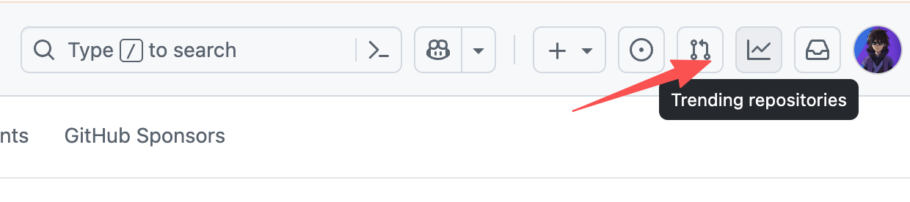

# monkey-scripts

A collection of Tampermonkey userscripts.

## GitHub Trending Button

Add a button to the GitHub header to quickly access the trending page.

### Installation

1. Install [Tampermonkey](https://www.tampermonkey.net/) (or another userscript manager).
2. Open the install link below; your manager should prompt you to install the script.

**Install (one-click):** [github-trending-button.user.js](https://raw.githubusercontent.com/wenyuanw/monkey-scripts/main/github-trending-button.user.js)

You can also copy that URL into Tampermonkey’s “Install from URL” if needed.

**Source file in repo:** [github-trending-button.user.js](github-trending-button.user.js)

