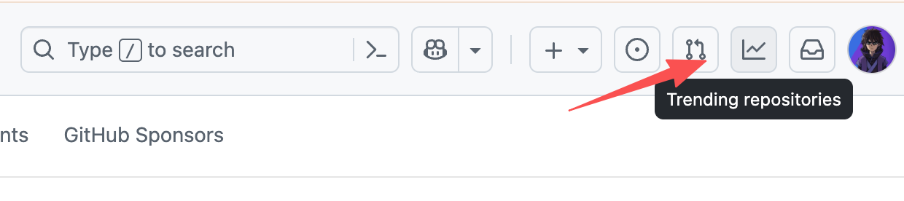

# monkey-scripts

A collection of Tampermonkey userscripts.

## GitHub Trending Button

Add a button to the GitHub header to quickly access the trending page.

### Installation

1. Install [Tampermonkey](https://www.tampermonkey.net/) (or another userscript manager).
2. Open the install link below; your manager should prompt you to install the script.

**Install (one-click):** [github-trending-button.user.js](https://raw.githubusercontent.com/wenyuanw/monkey-scripts/main/github-trending-button.user.js)

You can also copy that URL into Tampermonkey’s “Install from URL” if needed.

**Source file in repo:** [github-trending-button.user.js](github-trending-button.user.js)

## GitHub Feed: Incoming Repository Stars

Filter the GitHub Feed to show only activity cards where someone starred one of your repositories. Filtering is off by default. Click the star icon beside **Filter** to turn it on; the active state uses a filled gold star and highlighted background. Click again to return to the full feed. Hover over the icon to see its current action. While filtering is on, if **More** is visible when enabled, the script loads one batch. After that, it waits for you to scroll down until **More** is visible before each next batch, with a limit of 25 automatic loads per page visit.

### Installation

1. Install [Tampermonkey](https://www.tampermonkey.net/) (or another userscript manager).
2. Open the install link below; your manager should prompt you to install the script.

**Install (one-click):** [github-feed-incoming-stars.user.js](https://raw.githubusercontent.com/wenyuanw/monkey-scripts/main/github-feed-incoming-stars.user.js)

You can also copy that URL into Tampermonkey’s “Install from URL” if needed.

**Source file in repo:** [github-feed-incoming-stars.user.js](github-feed-incoming-stars.user.js)
